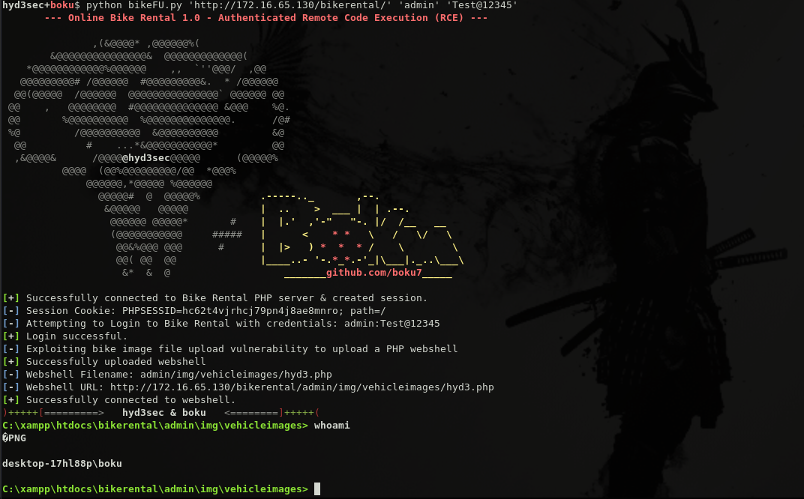

## Online Bike Rental - Authenticated Remote Code Execution (RCE)
##### Exploit Author: Adeeb Shah (@hyd3sec) & Bobby Cooke (boku)
##### Vulnerability Discovery: Adeeb Shah (@hyd3sec)

##### MITRE Vulnerability Stats
+ CWE-434: Unrestricted Upload of File with Dangerous Type
+ Overall CVSS Score: 7.2 
+ CVSS v3.1 Vector: 
  - AV:N/AC:L/PR:H/UI:N/S:C/C:H/I:H/A:H/E:F/RL:U/RC:C/CR:L/IR:L/AR:L/MAV:N/MAC:L/MPR:H/MUI:N/MS:C/MC:H/MI:H/MA:H
- CVSS Base Score: 9.1
- Impact Subscore: 6.0 
- Exploitability Subscore: 2.3
- CVSS Temporal Score: 8.9 
- CVSS Environmental Score: 7.2 
- Modified Impact Subscore: 4.5
### Vulnerability Description:
+ Online Bike Rental v1 suffers from an authenticated file upload vulnerability allowing remote attackers to gain remote code execution (RCE) on the hosting webserver via uploading a maliciously crafted image.
### Vendor Info
+ Vendor Homepage: ttps://www.sourcecodester.com/php/14374/online-bike-rental-phpmysql.html
+ Software Link: ttps://www.sourcecodester.com/sites/default/files/download/Warren%20Daloyan/bikerental-php.zip
